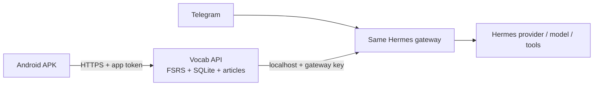

# Android 與同一個 Hermes 的連線規劃

## 結論

Android App 不直接執行 Hermes，也不把 Hermes 登入資訊或 API key 放進 APK。手機只呼叫 vocab-app 的 HTTPS API；vocab-app 再從伺服器端呼叫同一個 Hermes gateway。Telegram 與 vocab-app 使用同一個 Hermes gateway、同一個 provider／model 設定，但預設不是同一個 Telegram 對話串。



這樣手機、電腦瀏覽器與 Telegram 都會使用相同的 Hermes 設定；Hermes 金鑰只留在主機，文章與單字進度也仍由同一個 SQLite 保存。

## Hermes 端

Hermes 官方 API Server 是 OpenAI-compatible HTTP API，預設 gateway port 是 `8642`。在 Hermes 主機的 `%USERPROFILE%\\.hermes\\.env`（或官方設定位置）設定：

```dotenv
API_SERVER_ENABLED=true
API_SERVER_KEY=use-a-long-random-local-secret
API_SERVER_HOST=127.0.0.1
API_SERVER_PORT=8642
```

啟動：

```powershell
hermes gateway
```

第一階段讓 vocab-api 與 Hermes 在同一台電腦，Hermes 只綁 `127.0.0.1`，不直接暴露給手機。vocab-api 以伺服器端環境變數保存 gateway URL／key，呼叫 `POST /v1/chat/completions`。

Hermes 官方文件說明同一個 gateway 可同時承接 Telegram 與 API Server；API Server 也支援 session key，所以未來若要讓 App 延續同一個 Hermes 對話，再加入穩定的 `X-Hermes-Session-Key` 映射即可。不要直接把 Telegram bot token 或 Hermes key 放到 APK。

## 手機到 vocab-api

### 家用 Wi‑Fi（第一個可測版本）

- 電腦服務綁 `0.0.0.0`，手機與電腦在同一個可信任 Wi‑Fi。
- 測試 APK 可暫時連電腦的 LAN IP，例如 `http://192.168.0.196:4176`；這只限可信任家用 Wi‑Fi，正式版改成 HTTPS。
- vocab-api 增加 App token，並限制 CORS；不要直接把 Hermes `8642` 暴露給手機。
- 這個模式需要電腦開機，適合先驗證 UI 與功能。

### 外出使用（正式個人版）

- 把電腦或 VPS 放在 Tailscale／其他私有 VPN 網路。
- APK 只連私有 HTTPS URL；不要用未加密的公開 HTTP 或路由器 port forwarding。
- Hermes gateway 仍只接受 vocab-api 的伺服器端呼叫。

### 完全離線 APK

這是第三階段：需要把 vocab-api 的 SQLite／FSRS 邏輯移植到 Android 本機，並決定 Hermes 是使用遠端 provider 還是另建 Android 可執行 runtime。它不是單純 Capacitor 包裝，應與 LAN APK 分開規劃。

## 實作順序

1. 新增 `HermesGatewayClient`，保留目前 `/api/articles` 的 JSON contract，先以 gateway API 取代每次 spawn `hermes --oneshot`。
2. 在 vocab-api 加入 App token、CORS allowlist、健康檢查與 Hermes gateway 狀態。
3. Android APK 使用 Capacitor；正式設定不寫死開發用 `server.url`，改用 HTTPS API base URL。
4. 用同一組選取單字測試：Web → Hermes、Android → Hermes、Telegram → Hermes，確認 provider／model 一致。
5. 再加入 session key，只有在確定要讓 App 與 Telegram 共用對話歷史時才開啟。

`element` 內容屬於唯讀範圍；以上架構只會新增 bridge、授權與 Android 包裝層，不修改它的內容。
